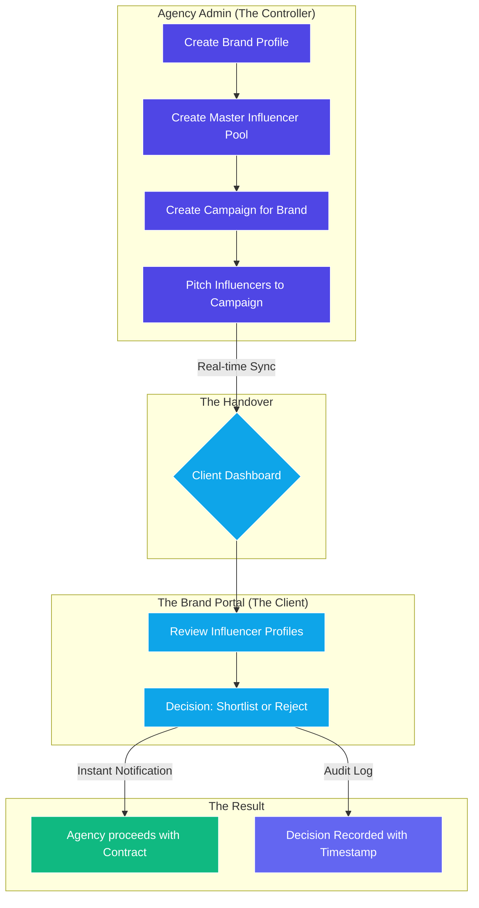

# Visual Workflow Diagram

You can use this visual flow to explain how data moves through the portal.

### Key Stages Explained:

1.  **Preparation (Agency):** You build your library of talent and set up the client's account.
2.  **The Pitch:** You select specific talent from your library that fits a specific brand campaign.
3.  **The Portal:** The client receives a high-end, branded experience where they can review your suggestions.
4.  **The Decision:** The client takes action. No more "I'll let you know." They click a button, and you see it instantly.
5.  **Data Security:** Throughout this whole process, the **RLS (Row Level Security)** ensures that no other client can see these negotiations.
